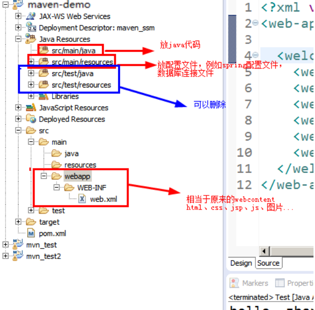

# Maven
* 依赖管理：方便的添加和管理jar包
* 构建工具：编译，单元测试，生成文档，打包部署
* 项目信息管理
* 核心思想：**约定优先配置**

## Maven环境搭建
* 下载安装：官网下载Maven包,解压到不含中文和特殊字符的目录
* 配置环境变量：检查JAVA_HOME是否正确配置
  * M2_HOME--maven根目录
  * PATH--bin目录
* 控台界面输入mvn -v验证是否安装正确

## 修改默认本地仓库
* 配置好Maven后默认仓库是存放在c盘的，久之，c盘空间不足
* 打开`%M2_HONE%\conf\settings.xml`
* 在`<setting>`标签内添加`<localRepository>D:\maven\repository</localRepository>`(路径自定)

## 配置eclipse/idea环境
* 设置里添加maven根目录以及仓库地址
  * Installtions->add->maven根目录
  * UserSettings->settings.xml

## Maven仓库概述
* 本地仓库
* 远程仓库:eg阿里的maven仓库，其他的公共仓库,公司的仓库
* 中间仓库:maven官方的仓库,服务器在国外

## Eclipse中创建Maven项目
* 项目目录结构
```
Hello-----------------项目根目录
->.settings
->src-----------------源码目录
  ->main--------------主程序目录
    ->java------------java源代码
    ->resource--------xml等配置文件目录
  ->test--------------测试文件目录
    ->java------------测试代码
    ->resource--------测试配置文件目录
->target--------------编译结果
.classpath
.project
pom.xml---------------Maven配置文(**重要**)
```

## pom文件

项目依赖什么jar包，就在pom文件中添加对应的<dependency>配置。
具体配置方式，到maven中央仓库网站查看即可。
配置后的jar包将会被下载到指定的本地仓库中。
```xml
  <dependencies>
    <dependency>
      <groupId>junit</groupId>
      <artifactId>junit</artifactId>
      <version>4.12</version>
      <scope>test</scope>
    </dependency>
  </dependencies>
```

## 编译 运行 安装
* 编译
  * 右键项目文件run as->maven build...
  * goals中输入compile
* 运行
  * run as->javaapplet
* 安装
  * run as->maven install
  * **安装后可以在其他maven项目中的pom.xml中引用**

## Maven坐标
* gav
  * groupid 公司域名倒叙
  * artfactid 项目名称/项目模块名称
  * version 版本
```xml
  <dependency>
      <groupId>com.alibaba</groupId>
      <artifactId>fastjson</artifactId>
      <version>1.2.51</version>
  </dependency>
```

## Maven的web工程



* 添加JavaEE环境
  * Maven的web项目中没有自带JavaEE环境 ，因此在创建servlet和jsp时会出错
  * 解决方式：
  * 方式一： 把 tomcat添加到项目的buildpath中
  * 方式二： 添加servlet和jsp的依赖
    ```xml
     <dependency>
			<groupId>javax.servlet</groupId>
			<artifactId>servlet-api</artifactId>
			<version>2.5</version>
			<scope>provided</scope>
		</dependency>
		<dependency>
			<groupId>javax.servlet</groupId>
			<artifactId>jsp-api</artifactId>
			<version>2.0</version>
			<scope>provided</scope>
		</dependency>
    ```

## 设置Maven中jdk版本

```xml
<plugins>
			<plugin>
				<artifactId>maven-war-plugin</artifactId>
				<configuration>
					<version>3.1</version>
				</configuration>
			</plugin>
			<!-- java编译插件 -->
			<plugin>
				<groupId>org.apache.maven.plugins</groupId>
				<artifactId>maven-compiler-plugin</artifactId>
				<version>2.3.2</version>
				<configuration>
					<source>1.7</source>
					<target>1.7</target>
					<encoding>UTF-8</encoding>
				</configuration>
			</plugin>
		</plugins>
```

## 更改Maven下载源
* 默认仓库下载很慢，可以使用阿里的仓库
* 方法一：在pom文件中添加
  ```xml
   <!-- 从Maven中央仓库下载东西速度慢，可能导致下载失败，在 这里配置阿里的镜像，从阿里下载-->
   <repositories>
  	<repository>
  		<id>alimaven</id>
  		<name>aliyun maven</name>
  		<url>http://maven.aliyun.com/nexus/content/groups/public/</url>
  	</repository>
  </repositories>
  ```
* 方法二：修改maven的setting.xml文件,在`<mirrors>标签中添加
  ```xml
    <mirror>
      <id>alimaven</id>
      <name>aliyun maven</name>
      <url>http://maven.aliyun.com/nexus/content/groups/public/</url>
      <mirrorOf>central</mirrorOf>
    </mirror>
  ```
