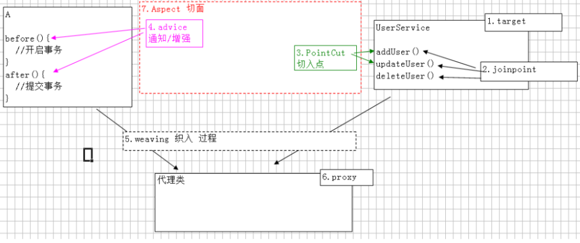

# SpringAOP 面向切面编程

## 代理设计模式

### 静态代理
* 实体类
```java
public class Person {
    private Integer id;
    private String name;
    @Override
    public String toString() {
        return "Person{" +
                "id=" + id +
                ", name='" + name + '\'' +
                '}';
    }
    public Person(Integer id, String name) {
        this.id = id;
        this.name = name;
    }
    public Person() {
    }
    public Integer getId() {
        return id;
    }
    public void setId(Integer id) {
        this.id = id;
    }
    public String getName() {
        return name;
    }
    public void setName(String name) {
        this.name = name;
    }
}
```
* 接口类
```java
public interface UserServec {
    public  void addUser(Person person);
    public  void  deleteUser(Person person);
}
```

* 实现类(实现接口)
```java
public class UserServceimpl implements UserServec {
    @Override
    public void addUser(Person person) {
        System.out.println("添加了员工");
    }
    @Override
    public void deleteUser(Person person) {
        System.out.println("删除了员工");
    }
}
```
* 事务类(增强类)
```java
public class MyTransaction {
    public void before(){
        System.out.println("开启事务");
    }
    public void after(){
        System.out.println("关闭事务");
    }
}
```
* 代理类(利用实现类，加入增强类实现接口类)
```java
public class ProxyUser implements UserServec{
    private UserServec us;
    private MyTransaction t;
    public ProxyUser() {
    }
    public ProxyUser(UserServec us, MyTransaction t) {
        this.us = us;
        this.t = t;
    }
    @Override
    public void addUser(Person person) {
        t.before();
        us.addUser(person);
        t.after();
    }
    @Override
    public void deleteUser(Person person) {
        t.before();
        us.deleteUser(person);
        t.after();
    }
}
```

* 测试
```java
/**
 * 静态代理，代理类和真实类需要实现相同接口。
 * 静态代理类对象调用接口方法，使用真实类对象的方法。
 * 调用真实类方法先后可以加入事务类的方法。
 * 事务类对象以及真实类对象通过构造方法设置。
 */
public class testProxy {
        public static void main(String[] args) {
            Person p = new Person(1, "cx");
            ProxyUser proxyUser = new ProxyUser(new UserServceimpl(),new MyTransaction());
            proxyUser.addUser(p);
            System.out.println("----------------------------------");
            proxyUser.deleteUser(p);
        }
}
```

### jdk自带的动态代理
* JDK代理限制：目标类需要实现一个接口！！！
* 接口类以及实体类
```java
public class User {
    private Integer id;
    private String name;
    @Override
    public String toString() {
        return "User{" +
                "id=" + id +
                ", name='" + name + '\'' +
                '}';
    }
    public Integer getId() {
        return id;
    }
    public void setId(Integer id) {
        this.id = id;
    }
    public String getName() {
        return name;
    }
    public void setName(String name) {
        this.name = name;
    }
    public User(Integer id, String name) {
        this.id = id;
        this.name = name;
    }
    public User() {
    }
}
```

```java
public interface usInterface {
    public void addUser(User user);
    public void deleteUser(User user);
}
```
* 实现类

```java
public class UserServce implements usInterface{
    public void addUser(User user){
        System.out.println("添加了User"+user);
    }
    public void deleteUser(User user){
        System.out.println("删除了User"+user);
    }
}
```
* 增强类

```java
public class Tran {
    public void start(){
        System.out.println("开启了事务");
    }
    public void end(){
        System.out.println("结束了事务");
    }
}
```

* 动态代理类(实现invocationhandler)
```java
/**
 * 动态代理类
 */
public class ObjectInterceptor implements InvocationHandler {
    //目标类
    private UserServce us;
    //切面类
    private Tran t;
    //构造获取对象
    public ObjectInterceptor(UserServce us, Tran t) {
        this.us = us;
        this.t = t;
    }
    @Override
    public Object invoke(Object proxy, Method method, Object[] args) throws Throwable {
        //切面类
        t.start();
        //目标类的各种方法
        method.invoke(us,args);
        //切面类
        t.end();
        //目标方法的返回值
        return null;
    }
}
```
* 测试类
```java
public class tset {
    public static void main(String[] args) {
        UserServce us = new UserServce();
        Tran t = new Tran();
        ObjectInterceptor proxyObj = new ObjectInterceptor(us, t);
        usInterface userServce = (usInterface)Proxy.newProxyInstance(us.getClass().getClassLoader(),us.getClass().getInterfaces(),proxyObj);
        userServce.addUser(new User(1,"cx"));
        userServce.deleteUser(new User(2,"cn"));
    }
}
```

### 使用CGLib代理器
* 使用jdk创建动态代理的缺点很明显，只能代理接口的实现类。若一个类没有实现接口就不能直接代理该类
* 同过Maven导入cglib包
```xml
<dependency>
		<groupId>cglib</groupId>
		<artifactId>cglib</artifactId>
		<version>2.2.2</version>
</dependency>
```
* 创建cglib代理器
```java
public class cglibProxy implements MethodInterceptor {
    //获取增强类对象
    private  trans t;
    public cglibProxy(){ }
    public cglibProxy(trans t) {
        this.t = t;
    }
    //设置被代理对象
    private Enhancer enhancer = new Enhancer();
    public Object setProxyObject(Class clazz){
        enhancer.setSuperclass(clazz);
        enhancer.setCallback(this);
        return  enhancer.create();
    }
    //需要重写的方法
    public Object intercept(Object o, Method method, Object[] objects, MethodProxy methodProxy) throws Throwable {
        t.start();
        Object o1 = methodProxy.invokeSuper(o, objects);
        t.end();
        return o1;
    }
}
```
* 测试类
```java
public class tsetlei {
    public static void main(String[] args) {
        trans t = new trans();
        cglibProxy cglibProxy = new cglibProxy(t);
        UserServce userServce = (UserServce) cglibProxy.setProxyObject(UserServce.class);
        userServce.addUser();
        userServce.deleteUser();
    }
}
```
* 输出结果
```
start t ==>
addUser()
end t ==>
start t ==>
deleteUser()
end t ==>
```
**以上是关于代理设计模式的介绍以及实现**
****
## AOP术语
* target 目标类，**需要被代理的类**
* Joinpoint 连接点，可能被拦截到的方法，例如：**所有的方法**都需要被代理
* PointCut 切入点,已经被增强的连接点，比如addUser()
* advice 通知，增强，增强代码，比如start(),end()
* Weaving 织入，把增强advice应用到目标对象target的过程
* proxy 代理类，advice与pointcut所在的类
* aspect 切面，advice与pointcut的结合



## Spring的AOP

* 导入包
```xml
<dependency>
    <groupId>aopalliance</groupId>
    <artifactId>aopalliance</artifactId>
    <version>1.0</version>
</dependency>
<!-- https://mvnrepository.com/artifact/org.aspectj/aspectjweaver -->
<dependency>
    <groupId>org.aspectj</groupId>
    <artifactId>aspectjweaver</artifactId>
    <version>1.8.10</version>
</dependency>
<!-- https://mvnrepository.com/artifact/org.springframework/spring-aspects -->
<dependency>
    <groupId>org.springframework</groupId>
    <artifactId>spring-aspects</artifactId>
    <version>4.3.8.RELEASE</version>
</dependency>
<dependency>
    <groupId>org.springframework</groupId>
    <artifactId>spring-aop</artifactId>
    <version>4.3.8.RELEASE</version>
</dependency>
<dependency>
    <groupId>org.springframework</groupId>
    <artifactId>spring-context-support</artifactId>
    <version>4.3.8.RELEASE</version>
</dependency>
<dependency>
    <groupId>org.springframework</groupId>
    <artifactId>spring-context</artifactId>
    <version>4.3.8.RELEASE</version>
</dependency>
<dependency>
    <groupId>org.springframework</groupId>
    <artifactId>spring-core</artifactId>
    <version>4.3.8.RELEASE</version>
</dependency>
<dependency>
    <groupId>org.springframework</groupId>
    <artifactId>spring-beans</artifactId>
    <version>4.3.8.RELEASE</version>
</dependency>
<dependency>
    <groupId>org.springframework</groupId>
    <artifactId>spring-expression</artifactId>
    <version>4.3.8.RELEASE</version>
</dependency>
<dependency>
    <groupId>commons-logging</groupId>
    <artifactId>commons-logging</artifactId>
    <version>1.1.2</version>
</dependency>
<dependency>
    <groupId>log4j</groupId>
    <artifactId>log4j</artifactId>
    <version>1.2.14</version>
</dependency>
<dependency>
    <groupId>mysql</groupId>
    <artifactId>mysql-connector-java</artifactId>
    <version>8.0.12</version>
</dependency>
<dependency>
    <groupId>commons-dbcp</groupId>
    <artifactId>commons-dbcp</artifactId>
    <version>1.4</version>
</dependency>
```
