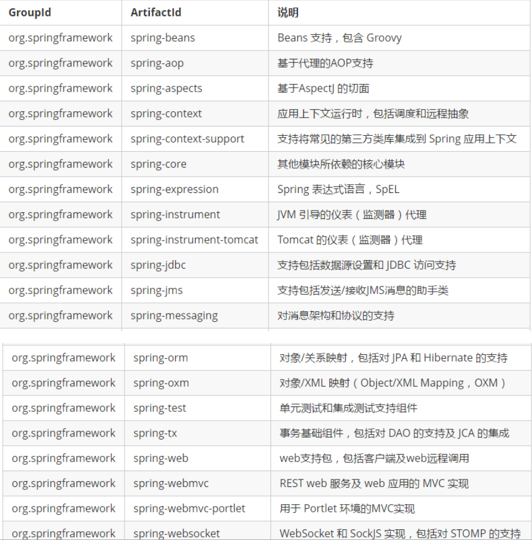

<!-- TOC depthFrom:1 depthTo:6 withLinks:1 updateOnSave:1 orderedList:0 -->

- [Spring基础](#spring基础)
	- [Rod Johnson](#rod-johnson)
	- [Spring介绍](#spring介绍)
	- [Spring作用](#spring作用)
	- [Spring组成](#spring组成)
	- [IOC-控制反转](#ioc-控制反转)
	- [DI-依赖注入](#di-依赖注入)
	- [创建项目](#创建项目)
		- [通过maven导入spring所依赖的包](#通过maven导入spring所依赖的包)
		- [创建配置文件applicationContext.xml](#创建配置文件applicationcontextxml)
		- [获取对象](#获取对象)
		- [配置文件详解](#配置文件详解)
	- [创建对象方式](#创建对象方式)
		- [调用无参构造](#调用无参构造)
		- [调用有参构造](#调用有参构造)
		- [静态工厂模式](#静态工厂模式)
		- [非静态工厂模式](#非静态工厂模式)
	- [DI--依赖注入](#di-依赖注入)
		- [set方法注入](#set方法注入)
		- [构造函数注入](#构造函数注入)
		- [p名称空间注入](#p名称空间注入)
		- [spel注入](#spel注入)
		- [复杂类型注入](#复杂类型注入)
	- [Spring注解](#spring注解)

<!-- /TOC -->
# Spring基础

## Rod Johnson

Spring Framework创始人，著名作者。 Rod在悉尼大学不仅获得了计算机学位，同时还获得了音乐学位。更令人吃惊的是在回到软件开发领域之前，他还获得了音乐学的博士学位。 有着相当丰富的C/C++技术背景的Rod早在1996年就开始了对Java服务器端技术的研究。他是一个在保险、电子商务和金融行业有着丰富经验的技术顾问，同时也是JSR-154（Servlet2.4）和JDO2.0的规范专家、JCP的积极成员，是Java development community中的杰出人物。

## Spring介绍

* 开放源码
* 高内聚低耦合
* 基于IOC和AOP架构JavaEE

## Spring作用
* 方便**解耦**，简化开发：创建对象，**维护依赖关系**
* AOP编程：**面向切面编程**,权限拦截，运行监控
* **声明式事务**支持：通过配置完成对事务的支持
* 方便**集成**其他框架

## Spring组成




## IOC-控制反转

* 用户不用自己创建对象，交给sprin框架创建

## DI-依赖注入

* 创建对象实例时，同时对这个对象注入所依赖的属性
  * **给对象属性赋值的过程叫做依赖注入**

********

## 创建项目

### 通过maven导入spring所依赖的包
```xml
<dependencies>
		<dependency>
			<groupId>org.springframework</groupId>
			<artifactId>spring-context</artifactId>
			<version>4.3.8.RELEASE</version>
		</dependency>
		<dependency>
			<groupId>org.springframework</groupId>
			<artifactId>spring-core</artifactId>
			<version>4.3.8.RELEASE</version>
		</dependency>

		<dependency>
			<groupId>org.springframework</groupId>
			<artifactId>spring-beans</artifactId>
			<version>4.3.8.RELEASE</version>
		</dependency>
		<dependency>
			<groupId>org.springframework</groupId>
			<artifactId>spring-context-support</artifactId>
			<version>4.3.8.RELEASE</version>
		</dependency>

		<dependency>
			<groupId>org.springframework</groupId>
			<artifactId>spring-expression</artifactId>
			<version>4.3.8.RELEASE</version>
		</dependency>

		<dependency>
			<groupId>commons-logging</groupId>
			<artifactId>commons-logging</artifactId>
			<version>1.1.2</version>
		</dependency>

		<dependency>
			<groupId>log4j</groupId>
			<artifactId>log4j</artifactId>
			<version>1.2.14</version>
		</dependency>

	</dependencies>
```

### 创建配置文件applicationContext.xml

**创建实体类Person**

```java
public class Person {
    private Integer id;
    private String name;
    private Integer age;
    ...
}
```
**管理对象**
```xml
<?xml version="1.0" encoding="UTF-8" standalone="no"?>
<beans xmlns="http://www.springframework.org/schema/beans"
       xmlns:xsi="http://www.w3.org/2001/XMLSchema-instance"
       xsi:schemaLocation="http://www.springframework.org/schema/beans http://www.springframework.org/schema/beans/spring-beans.xsd">

       <bean id="person_id" name="person_name" class="com.hibian.bean.Person" />
</beans>
```

### 获取对象
```java
import com.hibian.bean.Person;
import org.junit.Test;
import org.springframework.beans.factory.BeanFactory;
import org.springframework.beans.factory.xml.XmlBeanFactory;
import org.springframework.context.ApplicationContext;
import org.springframework.context.support.ClassPathXmlApplicationContext;
import org.springframework.context.support.FileSystemXmlApplicationContext;
import org.springframework.core.io.FileSystemResource;

public class testone {
    @Test
    public void test1(){//通过id
        ApplicationContext applicationContext = new ClassPathXmlApplicationContext("applicationContext.xml");
        Person person = (Person) applicationContext.getBean("person_id");
        System.out.println(person);
    }
    @Test
    public  void  test2(){//全路径加载xml，通过id获取bean
        ApplicationContext fileSystemXmlApplicationContext = new FileSystemXmlApplicationContext("G:\\IDEAprojects\\testSpring\\src\\main\\resources\\applicationContext.xml");
        Person person = (Person)fileSystemXmlApplicationContext.getBean("person_id");
        System.out.println(person.toString());
    }
    @Test
    public  void  test3(){//通过name获取bean
        ApplicationContext ac = new ClassPathXmlApplicationContext("applicationContext.xml");
        Person person = (Person) ac.getBean("person_name");
        System.out.println(person.toString());
    }
    @Test
    public  void  test4(){//通过.class不用强转类型了 by name
        ApplicationContext ac = new ClassPathXmlApplicationContext("applicationContext.xml");
        Person person = ac.getBean("person_name", Person.class);
        System.out.println(person.toString());
    }
    @Test
    public  void  test5(){//通过.class不用强转类型了 by id
        ApplicationContext ac = new ClassPathXmlApplicationContext("applicationContext.xml");
        Person person = ac.getBean("person_id", Person.class);
        System.out.println(person.toString());
    }
    @Test
    public  void  test6(){//通过.class不用强转类型了 by class
        ApplicationContext ac = new ClassPathXmlApplicationContext("applicationContext.xml");
        Person person = ac.getBean(Person.class);
        System.out.println(person.toString());
    }
    @Test
    public  void  test7(){//通过beanFactory--已过时
        BeanFactory bf = new XmlBeanFactory(new FileSystemResource("G:\\IDEAprojects\\testSpring\\src\\main\\resources\\applicationContext.xml"));
        Person person = bf.getBean("person_id", Person.class);
        System.out.println(person.toString());
    }
}
```
### 配置文件详解

bean标签对应属性


**scope属性**
* 默认为`scope="singleton"`创建的对象是单例
* `scope="prototype"`每次创建新的对象
* `scope="request"` 表示在一次**请求**范围内，Spring容器中的对象保持一个，公用同一个！
* `scope="session"` 表示在一次**会话**范围内，Spring容器中的对象保持一个，公用同一个！

**lazy-init属性**
* 只在单例创建时生效，`prototype`用户需要对象时创建对象
* 默认default为false，不是懒加载，创建容器时立即加载对象
* true，懒加载，需要对象时再创建对象

**设置初始化，销毁的方法**
在bean中添加init()与destory()方法
```java
public void init(){
    System.out.println("调用init()");
}
public void destory(){
    System.out.println("调用destory()");
}
```
在xml中配置初始化，销毁方法
```xml
<bean id="person_id" name="person_name" class="com.hibian.bean.Person"
    scope="singleton" lazy-init="default" init-method="init" destroy-method="destory"/>
```
```java
@Test
public void  test9(){//初始化，销毁
    ApplicationContext ac = new ClassPathXmlApplicationContext("applicationContext.xml");
    ((ClassPathXmlApplicationContext) ac).close();
}
```
****

## 创建对象方式

### 调用无参构造
* 默认创建对象的方法为无参构造
* 使用setter注入属性
```xml
<bean id="p2" name="p2_name" class="com.hibian.bean.Person"
      scope="singleton" lazy-init="default" init-method="init" destroy-method="destory">
    <property name="id" value="2"/>
    <property name="name" value="cn"/>
    <property name="age" value="17"/>
</bean>
```

### 调用有参构造
* 需要声明`constructor-arg`
* name index type 都可以进行判断是哪一个有参构造，有歧义时可以同时使用多个来消除歧义
```xml
<bean id="person_id" name="person_name" class="com.hibian.bean.Person"
      scope="singleton" lazy-init="default" init-method="init" destroy-method="destory">
    <constructor-arg name="id" value="1"/>
    <constructor-arg name="name" value="cx"/>
    <constructor-arg name="age" value="18"/>
</bean>
```

### 静态工厂模式
* 创建工厂类
```java
public class PersonFactroy {
    public static Person createPerson(){
        System.out.println("静态工厂创建Person()对象");
        return new Person();
    }
}
```
* 配置文件
```xml
<!--配置一个静态工厂-->
<bean id="personfactory" class="com.hibian.factory.PersonFactroy" factory-method="createPerson"/>
```
* 测试代码
```java
@Test
public void  test11(){//静态工厂创建对象
    ClassPathXmlApplicationContext context = new ClassPathXmlApplicationContext("applicationContext.xml");
    Person p1 = context.getBean("personfactory", Person.class);
    Person p2 = context.getBean("personfactory", Person.class);
    System.out.println(p1==p2);//true
    context.close();
}
```
### 非静态工厂模式
* 创建工厂类
```java
public class PersonFactory2 {
    public Person createPerson(){
        System.out.println("非静态工厂创建Person()对象");
        return new Person();
    }
}
```
* 配置文件
```xml
    <!--配置一个非静态工厂-->
    <!--先创建一个非静态工厂对象-->
    <bean id="ft" class="com.hibian.factory.PersonFactory2"/>
    <!--再调用这个对象的方法创建需要的对象-->
    <bean id="pf" class="com.hibian.factory.PersonFactory2" factory-bean="ft" factory-method="createPerson"/>
```
* 测试代码
```java
    public void test12(){//非静态工厂创建对象
        ClassPathXmlApplicationContext context = new ClassPathXmlApplicationContext("applicationContext.xml");
        Person pf = context.getBean("pf", Person.class);
        System.out.println(pf);
        context.close();
    }
```

****

## DI--依赖注入

### set方法注入
```xml
<!--默认使用的是setter方法注入-->
<bean id="person1" class="com.hibian.bean.Person">
    <property name="id" value="4396"/>
    <property name="name" value="clearlove"/>
    <property name="age" value="25"/>
</bean>
```
上面介绍了值类型数据的注入，下面介绍引用类型数据的注入，使用**ref**
* 创建一个hero实体类来试验
* 在person类中加入一个hero属性，并**添加setter方法**
```xml
    <!--默认使用的是setter方法注入-->
    <bean id="person1" class="com.hibian.bean.Person">
        <property name="id" value="4396"/>
        <property name="name" value="clearlove"/>
        <property name="age" value="25"/>
        <property name="hero" ref="hero1"/>
    </bean>
    <!-- ref的对象 -->
    <bean id="hero1" class="com.hibian.bean.Hero">
        <property name="id" value="1"/>
        <property name="name" value="盲僧"/>
    </bean>
```

### 构造函数注入
* 使用`onstructor-arg`通过构造函数注入
* 推荐index与type一起使用，消除歧义
```xml
    <!--默认使用的是setter方法注入-->
    <bean id="person1" class="com.hibian.bean.Person">
        <constructor-arg name="id" index="0" value="002"/>
        <constructor-arg name="name" index="1" value="uzi"/>
        <constructor-arg name="age" index="2" value="21"/>
        <constructor-arg name="hero" index="3" ref="hero1"/>
    </bean>
    <bean id="hero1" class="com.hibian.bean.Hero">
        <constructor-arg name="id" value="1"/>
        <constructor-arg name="name" value="卢西安"/>
    </bean>
```

### p名称空间注入
* xml文件头中，导入p名称空间`xmlns:p="http://www.springframework.org/schema/p"`
* 使用p:属性名注入，使用的是setter方法
```xml
    <!--使用的是无参构造，setter注入-->
    <bean id="p2" class="com.hibian.bean.Person" p:id="1" p:name="mlxg" p:age="23" p:hero-ref="h2"/>
    <bean id="h2" class="com.hibian.bean.Hero" p:id="2" p:name="梦魇"/>
```

### spel注入
* **sp**ring **e**xpression **l**anguage:spring表达式语言
* 使用`#{对象名.属性名}`得到一个已有对象的值
```xml
    <bean id="p2" class="com.hibian.bean.Person" p:id="1" p:name="mlxg" p:age="23" p:hero-ref="h2"/>
    <bean id="h2" class="com.hibian.bean.Hero" p:id="2" p:name="梦魇"/>

    <bean id="p3" class="com.hibian.bean.Person">
        <property name="id" value="2"/>
        <property name="name" value="xiaohu"/>
        <property name="age" value="#{p2.age}"/><!--spel表达式-->
        <property name="hero" ref="h2"/>
    </bean>
```

### 复杂类型注入
* 测试的实体类

```java
package com.hibian.bean;

import java.util.List;
import java.util.Map;
import java.util.Properties;

public class CollectionTest {
    private Object[] arrs;
    private List<Object> list;
    private Map<String,Object> map;
    private Properties properties;
    //TODO getter and setter
    public CollectionTest() {
    }
}

```
* 配置xml文件

```xml
<?xml version="1.0" encoding="UTF-8"?>
<beans xmlns="http://www.springframework.org/schema/beans"
       xmlns:xsi="http://www.w3.org/2001/XMLSchema-instance"
       xsi:schemaLocation="http://www.springframework.org/schema/beans http://www.springframework.org/schema/beans/spring-beans.xsd">

    <bean id="t1" class="com.hibian.bean.CollectionTest">
        <!--object[]-->
        <property name="arrs">
            <list>
                <value>2</value>
                <value>3</value>
                <value>3</value>
                <ref bean="h1"/>
            </list>
        </property>
        <property name="list">
            <list>
                <value>1</value>
                <value>2</value>
                <value>3</value>
                <ref bean="p1"/>
                <ref bean="h1"/>
            </list>
        </property>
        <property name="map">
            <map>
                <entry key="id" value="1"/>
                <entry key="person" value-ref="p1"/>
                <entry key="hero" value-ref="h1"/>
            </map>
        </property>
        <property name="properties">
            <props>
                <prop key="url">https://www.baidu.com</prop>
                <prop key="uername">root</prop>
                <prop key="password">123456</prop>
            </props>
        </property>
    </bean>

    <bean id="h1" class="com.hibian.bean.Hero">
        <property name="id" value="1"/>
        <property name="name" value="ez"/>
    </bean>
    <bean id="p1" class="com.hibian.bean.Person">
        <property name="id" value="1"/>
        <property name="name" value="uzi"/>
        <property name="hero" ref="h1"/>
        <property name="age" value="22"/>
    </bean>
</beans>
```
* 测试代码

```java
@Test
public void test1(){
    CollectionTest t1 = context.getBean("t1", CollectionTest.class);
    System.out.println(Arrays.toString(t1.getArrs()));
    System.out.println(t1.getList().toString());
    System.out.println(t1.getMap().toString());
    System.out.println(t1.getProperties().toString());
}
```
****

## Spring注解

* 导入jar包: spring-core,spring-context,spring-suppot-context,spring-beans,spring-expression, log4j,commons-logging, 本次多加一个:spring-aop

```xml
      <dependency>
          <groupId>org.springframework</groupId>
          <artifactId>spring-aop</artifactId>
          <version>4.3.8.RELEASE</version>
      </dependency>
```

* 引入context约束
  * `xmlns:context="http://www.springframework.org/schema/context"`
  * `http://www.springframework.org/schema/context `
  * `http://www.springframework.org/schema/context/spring/-context.xsd`
```xml
<?xml version="1.0" encoding="UTF-8"?>
<beans xmlns="http://www.springframework.org/schema/beans"
       xmlns:xsi="http://www.w3.org/2001/XMLSchema-instance"
       xmlns:context="http://www.springframework.org/schema/context"
       这一句需要注意下格式，不然要报错
       xsi:schemaLocation="http://www.springframework.org/schema/beans http://www.springframework.org/schema/beans/spring-beans.xsd
       http://www.springframework.org/schema/context http://www.springframework.org/schema/context/spring/-context.xsd">
<!-- 使用注解 需要扫描包 哪些包中哪些类有注解   com.spring 开头的包以及这个下面的所有包-->
<context:component-scan base-package="com.hibian.bean"/>
</beans>
```

* 创建实体类并添加注解
  * xml文件会扫描指定package下的java文件

```java
package com.hibian.bean;
import org.springframework.stereotype.Component;
@Component("antest")//声明为一个bean实体类，不写内容的话默认为首字母小写的类名
@Scope(scopeName = "prototype")//添加对象作用域：多对象
public class AnTest {
    @Value("1")//设置默认值，这样是通过反射赋值，加在setter上为通过setter赋值
    private Integer id;
    @Value("cx")
    private String name;
    @Value("student")
    private String des;
    public AnTest() {
    }
    //TODO getter , setter and toString
}

```

* 测试代码

```java
@Test
public void test1(){
    ClassPathXmlApplicationContext context = new ClassPathXmlApplicationContext("application-annotation.xml");
    AnTest antest = context.getBean("antest", AnTest.class);
    System.out.println(antest.toString());
    context.close();
}
```
