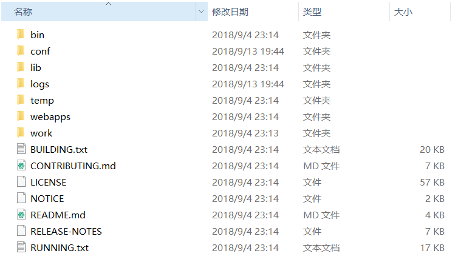
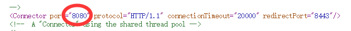
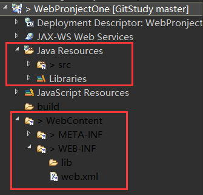

## 安装Tomcat
[下载地址](http://tomcat.apache.org/)
* 解压到非中文目录下
* 配置JAVA_HOME环境变量，使其为Jdk安装根目录
* 双击tomcat中bin\startup.bat启动服务
* 浏览器中输入http://localhost:8080/ ,出现tomcat界面即为安装成功
  * ps：服务器在阿里云：安全组添加开放8080端口的规则

## Tomcat目录结构

* bin 启动和关闭脚本
* conf 存放tomcat服务器的各种配置文件
* lib 存放javaweb依赖的jar包
* logs 存放日志文件
* temp 存放临时文件
* webapps 存放web项目，供外界访问
* work tomcat工作目录

## 安装Tomcat到Ubuntu
* 官网下载tar.gz 并使用sudo tar 解压
* 进入bin目录输入`./startup.sh`开启服务
* 输入`ps -ef|grep java`查看是否开启成功

## 使用默认端口号
* 浏览器默认添加端口号为80
* 将tomcat端口改为80，就不用输入端口号了
* conf/server.xml设置tomcat端口号

## Tomcat服务器虚拟目录映射方式
* server.xml中的host中设置
  * 在`<Host></Host>`这对标签加上`<Context path="/JavaWebApp" docBase="F:\JavaWebDemoProject" />`
  * path表示url中使用的地址，docBase表示服务器中物理地址
  * 缺点：添加新的项目后tomcat需要重启
* 让服务器自动映射
  * 直接将web项目扔入webapps目录即可
* 虚拟目录的映射方式三
  * 在tomcat目录下\conf\Catalina\loaclhost添加一个名字任取的xml文件比如a.xml
  * 写入`<Context path="/JavaWebApp" docBase="F:\JavaWebDemoProject" />`
  * 就可以通过过a.xml映射web项目目录了
    * eg.http://localhost:8080/a/

## 在eclipse中集成tomcat服务器
* eclipse调出server面板，可以看到是空的，右键New->Server
* 选择对应安装的tomcat版本，finish
* 双击server中的tomcat来到配置页面
* serverlocations中选择use tomcat installation
* ctrl+s保存关闭，配置完成

## 创建javaweb项目
* 项目中新建Dynamic Web Project项目

## javaweb项目目录结构与配置

* javaResource
  * scr 存放java代码
  * liberaries tomcat和javase包
* build 存放自动编译的.java文件目录
* WebContent(WebRoot) 存放部署到服务器的web项目
  * META-INF 工程相关信息元文件信息
  * WEB-INF 这个目录下的文件不能被客户端直接访问
    * lib 存放该工程用到的库
    * web.xml web工程配置文件
