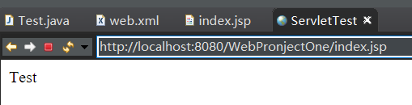
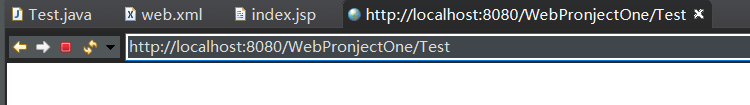
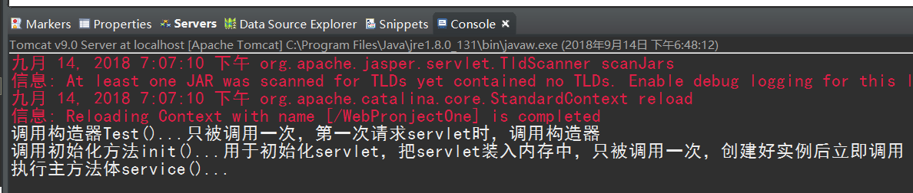
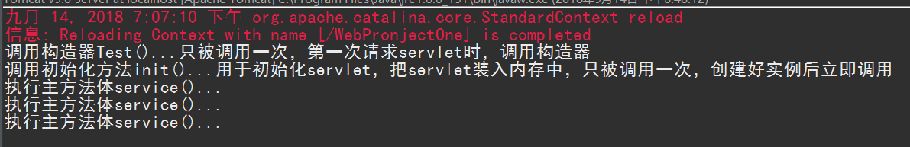
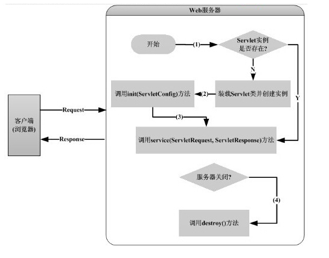

# Servlet Study
## 什么是Servlet？
Servlet，可以收集来自网页表单的用户输入，呈现来自数据库或者其他源的记录

servlet架构


servlet任务
* 接受客户端数据
* 获取客户端请求
* 处理数据并生成结果
* 发送数据到客户端
* 发送隐式的 HTTP 响应到客户端（浏览器）


## Servlet入门示例
* 创建servlet

```java
package com.test.serverlet;

import java.io.IOException;
import javax.servlet.Servlet;
import javax.servlet.ServletConfig;
import javax.servlet.ServletException;
import javax.servlet.ServletRequest;
import javax.servlet.ServletResponse;

//实现servlet接口
public class Test implements Servlet {

	//只被调用一次，第一次请求servlet时，调用构造器
	public Test() {
		System.out.println("调用构造器Test()...只被调用一次，第一次请求servlet时，调用构造器");
	}

	//web应用被卸载前调用，用于释放资源
	@Override
	public void destroy() {
		System.out.println("destroy()");
	}

	//用于初始化servlet，把servlet装入内存中，只被调用一次，创建好实例后立即调用
	@Override
	public void init(ServletConfig config) throws ServletException {
		System.out.println("调用初始化方法init()...用于初始化servlet，把servlet装入内存中，只被调用一次，创建好实例后立即调用");
	}

	//会被调用多次，每次请求都会调用service方法。用于响应请求
	@Override
	public void service(ServletRequest req, ServletResponse res) throws ServletException, IOException {
		System.out.println("执行主方法体service()...");
		System.out.println(req.getLocalName());
		System.out.println(req.getProtocol());
	}

	@Override
	public ServletConfig getServletConfig() {
		// TODO Auto-generated method stub
		return null;
	}

	@Override
	public String getServletInfo() {
		// TODO Auto-generated method stub
		return null;
	}

}

```
* web.xml里创建Servlet 映射关系

```xml
  <!-- 创建Sevlet映射关系 -->
  <servlet>
  	<servlet-name>Test</servlet-name>
  	<servlet-class>com.test.serverlet.Test</servlet-class>
  </servlet>
  <servlet-mapping>
  	<!-- 一个servlet可以有多个servlet-mapping -->
  	<servlet-name>Test</servlet-name>
  	<!-- 访问路径 -->
  	<url-pattern>/Test</url-pattern>
  </servlet-mapping>
```
* jsp代码 index.jsp

```html
<%@ page language="java" contentType="text/html; charset=ISO-8859-1"
    pageEncoding="ISO-8859-1"%>
<!DOCTYPE html>
<html>
  <head>
    <meta charset="ISO-8859-1">
    <title>ServletTest</title>
  </head>
    <body>
      Test
    </body>
</html>
```
* 运行tomcat服务器


  更改到servlet目录
  

  结果
  

  刷新页面只执行了主方法，这里就要说到servlet的生命周期了
  
* servlet生命周期


　  1、客户端向 Web 服务器发送请求，服务器查询 web.xml 文件配置。根据请求信息找到对应的 Servlet。

　　2、Servlet 引擎检查是否已经装载并创建了该 Servlet 的实例对象，如果有，则直接执行第4步，否则执行第3步，

　　3、Web 服务器加载 Servlet,并调用 Servlet 构造器（只会调用一次），创建 Servlet 的实例对象。并调用 init() 方法，完成 Servlet 实例对象的初始化（只会调用一次）。

　　4、Web 服务器把接收到的 http 请求封装成 ServletRequest 对象，并创建一个 响应消息的 ServletResponse 对象，作为 service() 方法的参数传入。（每一次访问都会调用一次该方法）

　　5、执行 service（） 方法，并将处理信息封装到 ServletResponse 对象中返回

　　6、浏览器拆除 ServletResponse 对象，形成 http 响应格式，返回给客户端。

　　7、Web 应用程序停止或者重新启动之前，Servlet 引擎将卸载 Servlet实例，并在卸载之前调用 destory() 方法

## 创建servlet的三种方法
* 实现servlet接口
* 继承GenericServlet
* 继承HttpServlet类
  * 有doPost()和doGet()分别处理两种请求

```java
package com.test.serverlet;

import java.io.IOException;
import java.io.PrintWriter;

import javax.servlet.ServletConfig;
import javax.servlet.ServletException;
import javax.servlet.http.HttpServlet;
import javax.servlet.http.HttpServletRequest;
import javax.servlet.http.HttpServletResponse;

@SuppressWarnings("serial")
public class testservlet2 extends HttpServlet{

	//构造方法
	public testservlet2() {
		System.out.println("构造器()");
	}

	//加载类到内存
	@Override
	public void init(ServletConfig config) throws ServletException {
		System.out.println("init()");
	}

	//处理post请求
	@Override
	protected void doPost(HttpServletRequest req, HttpServletResponse resp) throws ServletException, IOException {
		System.out.println("dopost");
	}

	//处理get请求
	@Override
	protected void doGet(HttpServletRequest req, HttpServletResponse resp) throws ServletException, IOException {
	      // 设置响应内容类型
	      resp.setContentType("text/html");

	      // 实际的逻辑是在这里
	      PrintWriter out = resp.getWriter();
	      out.println("<h1>Hello World</h1>");
	}

	@Override
	public void destroy() {
	}
}

```
