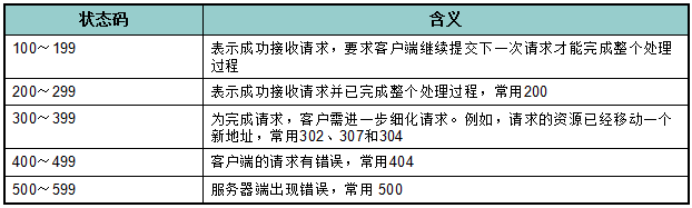
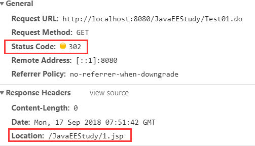
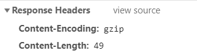
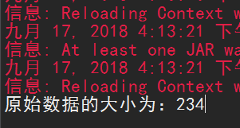
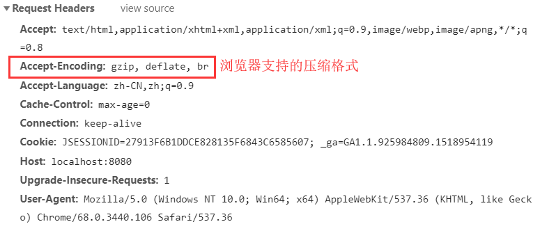
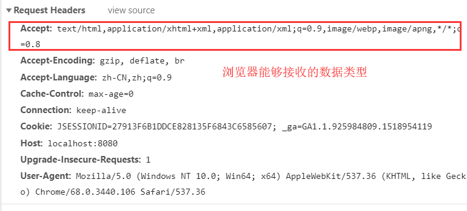
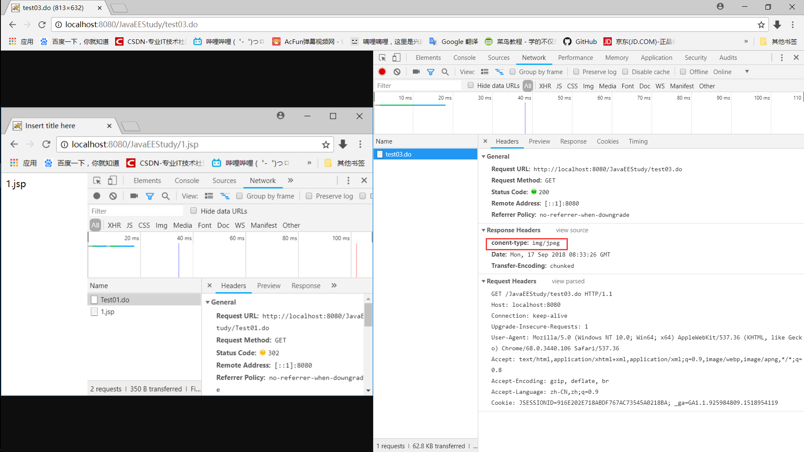
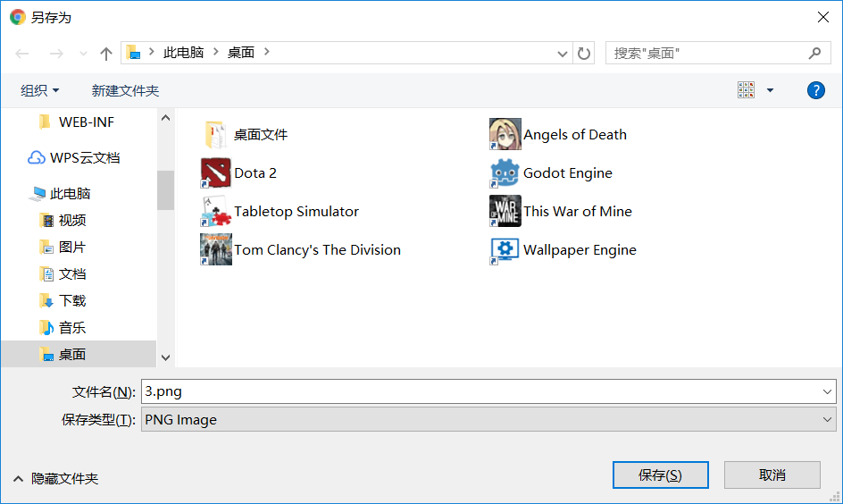

# HTTP
* HTTP是hypertext transfer protocol（超文本传输协议）的简写，它是TCP/IP协议的一个应用层协议，用于定义WEB浏览器与WEB服务器之间交换数据的过程。
* HTTP请求
  * 一个请求行 请求的方式(GET/POST等),请求资源位置名称,协议版本
    * GET有大小限制1K且为明文
    * POST无大小限制
  * 多个消息头及内容
    * accept:浏览器通过这个头告诉服务器，它所支持的数据类型
    * Accept-Charset: 浏览器通过这个头告诉服务器，它支持哪种字符集
    * Accept-Encoding：浏览器通过这个头告诉服务器，支持的压缩格式
    * Accept-Language：浏览器通过这个头告诉服务器，它的语言环境
    * Host：浏览器通过这个头告诉服务器，想访问哪台主机
    * If-Modified-Since: 浏览器通过这个头告诉服务器，缓存数据的时间
    * Connection：浏览器通过这个头告诉服务器，请求完后是断开链接还是保持链接
  * 一个空行
* HTTP响应
  * 一个HTTP响应代表服务器向客户端回送的数据，它包括： 一个状态行、若干消息头、一个空行以及实体内容
  * 一个状态行 返回服务器对于请求的结果
    * 
    * 404 找不到页面
    * 500 服务器内部错误
    * 200 服务器正常返回数据
    * 302 浏览器重定向
  * 若干消息头
    * HTTP响应中的常用响应头(消息头)
      * Location: 服务器通过这个头，来告诉浏览器跳到哪里
      * Server：服务器通过这个头，告诉浏览器服务器的型号
      * Content-Encoding：服务器通过这个头，告诉浏览器，数据的压缩格式
      * Content-Length: 服务器通过这个头，告诉浏览器回送数据的长度
      * Content-Language: 服务器通过这个头，告诉浏览器语言环境
      * Content-Type：服务器通过这个头，告诉浏览器回送数据的类型
      * Refresh：服务器通过这个头，告诉浏览器定时刷新
      * Content-Disposition: 服务器通过这个头，告诉浏览器以下载方式打数据
      * Transfer-Encoding：服务器通过这个头，告诉浏览器数据是以分块方式回送的
      * Expires: -1  控制浏览器不要缓存
      * Cache-Control: no-cache  
      * Pragma: no-cache
  * 一个空行
  * 实体内容

```html
eg：
HTTP/1.1 200 OK
Server: Apache-Coyote/1.1
Content-Type: text/html;charset=ISO-8859-1
Content-Length: 105
Date: Tue, 27 May 2014 16:23:28 GMT

<html>
    <head>
        <title>Hello World JSP</title>
    </head>
    <body>
        Hello World!
    </body>
</html>
```

## 设置状态码使浏览器重定向
```java
package com.test;
import java.io.IOException;
import javax.servlet.ServletException;
import javax.servlet.http.HttpServlet;
import javax.servlet.http.HttpServletRequest;
import javax.servlet.http.HttpServletResponse;

public class Test01 extends HttpServlet{
	private static final long serialVersionUID = 1L;
	@Override
	protected void doPost(HttpServletRequest req, HttpServletResponse resp) throws ServletException, IOException {
		resp.setStatus(302);//设置响应码，302为重定向
		resp.setHeader("Location", "/JavaEEStudy/1.jsp");
	}
	@Override
	protected void doGet(HttpServletRequest req, HttpServletResponse resp) throws ServletException, IOException {
		doPost(req, resp);
	}
}
```

跳转到了1.jsp页面


## 设置Content-Encoding响应头，告诉浏览器数据的压缩格式
```java
package com.test;

import java.io.ByteArrayOutputStream;
import java.io.IOException;
import java.util.zip.GZIPOutputStream;

import javax.servlet.ServletException;
import javax.servlet.http.HttpServlet;
import javax.servlet.http.HttpServletRequest;
import javax.servlet.http.HttpServletResponse;
/**
 * 这个小程序是用来演示以下两个小知识点
 *  1、使用GZIPOutputStream流来压缩数据
 *  2、设置响应头Content-Encoding来告诉浏览器，服务器发送回来的数据压缩后的格式
 */
public class test02 extends HttpServlet{
	private static final long serialVersionUID = -8571797314334496154L;
	@Override
	protected void doPost(HttpServletRequest req, HttpServletResponse resp) throws ServletException, IOException {
		String data = "abcdefghijklmnopqrstuvwxyz"
				+ "abcdefghijklmnopqrstuvwxyz"
				+ "abcdefghijklmnopqrstuvwxyz"
				+ "abcdefghijklmnopqrstuvwxyz"
				+ "abcdefghijklmnopqrstuvwxyz"
				+ "abcdefghijklmnopqrstuvwxyz"
				+ "abcdefghijklmnopqrstuvwxyz"
				+ "abcdefghijklmnopqrstuvwxyz"
				+ "abcdefghijklmnopqrstuvwxyz";
		System.out.println("原始数据的大小为：" + data.getBytes().length);

		ByteArrayOutputStream baos = new ByteArrayOutputStream();
		GZIPOutputStream gos = new GZIPOutputStream(baos);//buffer
		gos.write(data.getBytes());
		gos.close();
		//得到压缩后的数据
		byte g[] = baos.toByteArray();
		resp.setHeader("Content-Encoding", "gzip");
		resp.setHeader("Content-Length", g.length+"");
		resp.getOutputStream().write(g);
	}
	@Override
	protected void doGet(HttpServletRequest req, HttpServletResponse resp) throws ServletException, IOException {
		doPost(req, resp);
	}
}
```




## 设置content-type响应头，指定回送数据类型

```java
package com.test;

import java.io.IOException;
import java.io.InputStream;

import javax.servlet.ServletException;
import javax.servlet.http.HttpServlet;
import javax.servlet.http.HttpServletRequest;
import javax.servlet.http.HttpServletResponse;
//指定返回给浏览器的数据类型
public class test03 extends HttpServlet{
	private static final long serialVersionUID = 3295417844767266699L;
	@Override
	protected void doPost(HttpServletRequest req, HttpServletResponse resp) throws ServletException, IOException {
		 /**
         * 浏览器能接收(Accept)的数据类型有:
         * application/x-ms-application,
         * image/jpeg,
         * application/xaml+xml,
         * image/gif,
         * image/pjpeg,
         * application/x-ms-xbap,
         * application/vnd.ms-excel,
         * application/vnd.ms-powerpoint,
         * application/msword,
         */
		//设置相应头的数据类型
		resp.setHeader("conent-type", "img/jpeg");
		InputStream in = this.getServletContext().getResourceAsStream("/img/3.png");
		byte[] buf = new byte[1024];
		int len = 0;
		while((len=in.read(buf))>0) {
			resp.getOutputStream().write(buf,0,len);
		}
	}
	@Override
	protected void doGet(HttpServletRequest req, HttpServletResponse resp) throws ServletException, IOException {
		doPost(req, resp);
	}
}
```

## 设置content-disposition响应头，让浏览器下载文件

```java
package com.test;

import java.io.IOException;
import java.io.InputStream;

import javax.servlet.ServletException;
import javax.servlet.http.HttpServlet;
import javax.servlet.http.HttpServletRequest;
import javax.servlet.http.HttpServletResponse;

public class test05 extends HttpServlet{
	private static final long serialVersionUID = -5737017420793599843L;
	@Override
	protected void doPost(HttpServletRequest req, HttpServletResponse resp) throws ServletException, IOException {
		resp.setHeader("content-disposition", "attachment;filename=xxx.jpg");
		InputStream in = this.getServletContext().getResourceAsStream("img/3.png");
		byte[] buf = new byte[1024];
		int len = 0;
		while ((len=in.read(buf))>0) {
			resp.getOutputStream().write(buf, 0, len);
		}
	}
	@Override
	protected void doGet(HttpServletRequest req, HttpServletResponse resp) throws ServletException, IOException {
		doPost(req, resp);
	}
}

```
## 设置refresh响应头，让浏览器定时刷新
```java
package com.test;

import java.io.IOException;

import javax.servlet.ServletException;
import javax.servlet.http.HttpServlet;
import javax.servlet.http.HttpServletRequest;
import javax.servlet.http.HttpServletResponse;
//设置refresh响应头，让浏览器定时刷新
public class test04 extends HttpServlet{
	private static final long serialVersionUID = -2881962209124737416L;
	@Override
	protected void doPost(HttpServletRequest req, HttpServletResponse resp) throws ServletException, IOException {
		/**
		 * 设置refresh响应头，让浏览器每隔3秒定时刷新
		 */
		// resp.setHeader("refresh", "3");
		/**
		 * 设置refresh响应头，让浏览器3秒后跳转到http://www.baidu.com
		 */
		resp.setHeader("refresh", "3;http://www.baidu.com");
		resp.getWriter().write("3s later to Baidu");
	}
	@Override
	protected void doGet(HttpServletRequest req, HttpServletResponse resp) throws ServletException, IOException {
		doPost(req, resp);
	}
}
```
