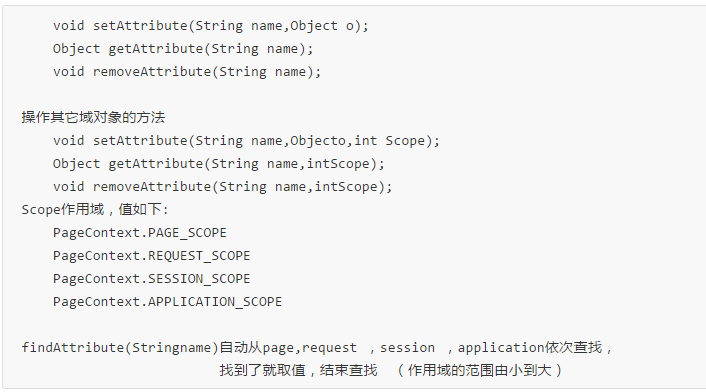
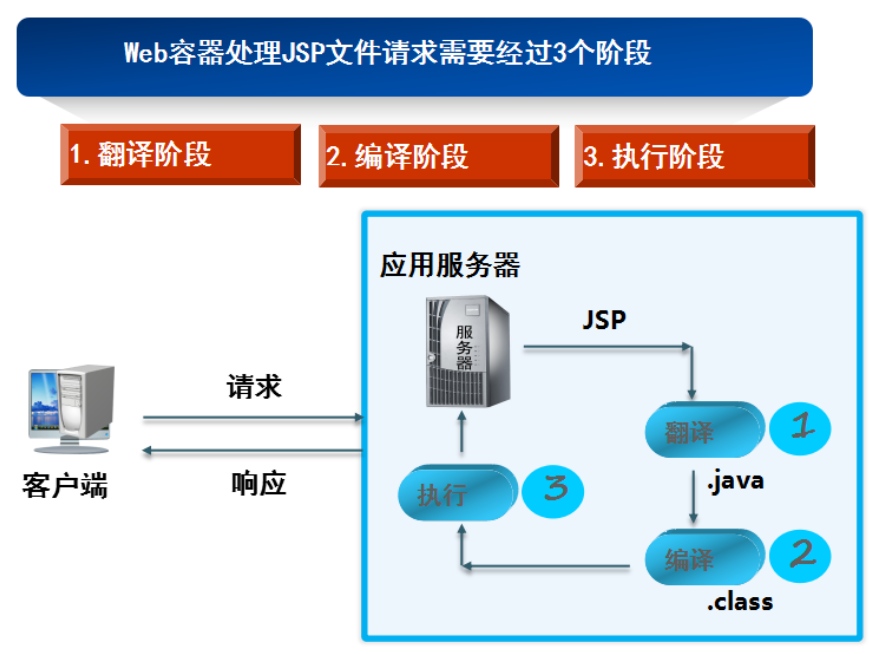

# JSP
* JSP简介:java Server Page,java服务器界面
* JSP特点html中嵌入java代码，提供动态数据。单纯的HTML只能提供静态数据。
* Jsp的本质为Servlet
  * Jsp主要用于页面展示
  * Servlet主要用于控制代码逻辑

## JSP页面组成
* 静态内容-html静态类容
* 指令-`<%@ %>`Page,include,taglib
  * `<%@ page language="java" contentType="text/html; charset=UTF-8"  pageEncoding="UTF-8"%>`
  * page
    * 定义整个页面的属性
    ```
      language      jsp中可以嵌入的语言 目前为止只能填java
      import        用来导包
      pageEncoding  设置当前jsp页面的编码方式
      contentType   设置浏览器查看这个页面时使用编码方式。等同于response.setContentType(“text/html”;charset=utf-8);服务器发送客户端的内容编码
      pageEncoding: Jsp文件本身的编码
      session       默认是true 当前jsp中能否使用session (如果为true，则在这个jsp中就已经可以使用session对象)
      isELIgnored   当前页面能否使用EL表达式 默认值false
      buffer        缓存区大小。JSP中有java.servlet.jsp.JspWriter输出字符流。设置输出数据的缓存大小。默认8kb.
      autoFlush     是否自动刷新缓冲区  默认true
      errorPage      指定错误页面
      isErrorPage    设置为错误页面 (设置为错误页面，就有处理异常的功能)
    ```
  * include
    * 静态包含 `<%@ include file="header.jsp" %>` 翻译时就把jsp文件合并到一起
    * 动态包含 `<jsp:include page="fileName"></jsp:include>` 翻译时为两个文件，代码执行到这一句时，才把jsp文件内容包含进来
* 表达式-`<%=java表达式>` JspWriter输出，不能加;
* Java脚本-`<% java代码 %>` 代码在Service()中
* 声明-`<%! 函数或者方法 %>` 声明在类中，内部类，全局变量，方法
* 动作(过时)-`<jsp:动作名></jsp:动作名>`eg `<jsp:include page="fileName">`
* 注释-`<!-- 客户端可以看到的注释 -->``<%-- 客户端不能看到的注释 --%>`

## JSP--9大内置对象4大作用域

* 9大内置对象
  * out-JspWriter类型，负责输出类容到html中
  * request-接受浏览器请求
    * 常用方法
      * getCookies()
      * getParameter()
      * getParameterValues()--String[]
      * getParameterMap()--BeanUtils时用到
  * response-响应浏览器请求
    * 常用方法
  * session-用户会话信息
  * page-Object类型，封装了当前jsp页面信息
  * application-servletContext类型，web应用相关信息
  * config-ServletConfig类型，封装Jsp配置信息
  * pageContext-PageContext类型，封装网页属性信息
    * Jsp上下文对象，可以用来获取其他八个内置对象
  * exception 由jsp的isErrorPage="false"控制 默认为关闭

* 4大作用域
  * pageContext-仅包含当前页面
  * request-包含于请求中，可转发到其他页面，重定向后丢失
  * session-包含于一次会话中，关闭浏览器后失效
  * application-包含于整个web项目中,可以设置其他作用域的对象
    * 

## JSP运行原理

* 第一次访问JSP的时候，JSP会被**翻译**成.java的源文件，然后再被**编译**成.class的字节码文件，最后**执行字节码文件**，呈现运行结果。
* 第二次访问该JSP的时候，先去检测这个JSP内容**有没有发生改变**，如果内容有改变，那么将会执行翻译→编译→执行过程。如果JSP没有发生改变，那么将直接运行字节码文件，返回结果。
