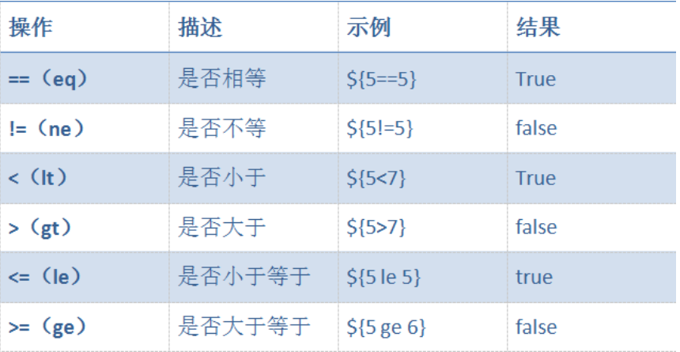
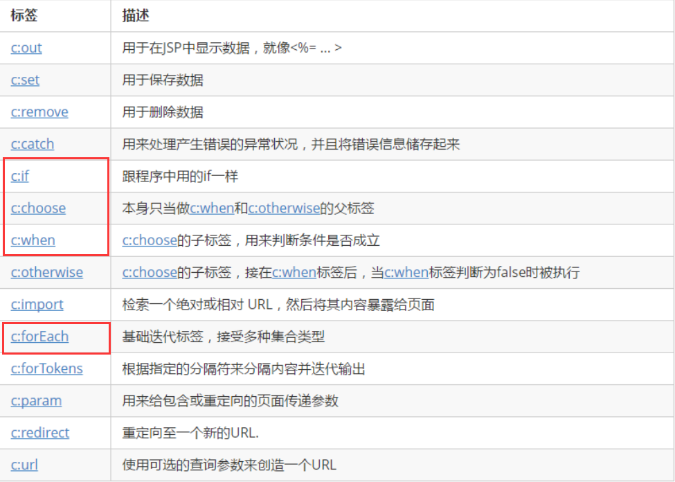
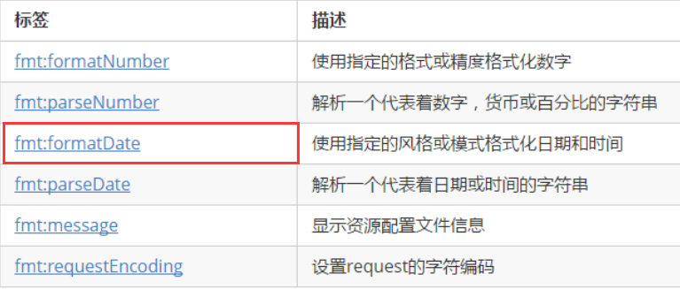

# EL表达式
## 概念：
  * EL表达式：**expression language**
  * 格式：`${el表达式}` 等价于 **findAttribute(name)**
    * 区别:el表达式得到的空值为`""`,而getAttribute(name)为`null`

## 获取作用域中的值
  * `${name}`寻找的先后顺序为 page,request,session,application
  * 获取对应作用域的值
    * `${pageScope.key}`
    * `${requesScope.key}`
    * `${sessionScope.key}`
    * `${apllicationScope.key}`

## 访问对象的属性
  * **要求**：属性必须要有**get方法**el表达式才能访问到
  demo1
  ```java
  User u = new User("cx",18,"man");
  request.setAttribute("user",u);
  request.getRequestDispatcher(url).foward(request,response);
  //JSP中
  ${user.name}
  ${user.age}
  ${user.sex}
  ```
  demo2
  ```java
  <% pageContext.setAttribute("user", new User("chenxin",1)); %>
  ${user.userName }
  ${user.state }
  ```

## 访问集合
  * **el表达式无法遍历集合**

  ```java
  <%
  User u1 = new User("chenxin",1);
  User u2 = new User("chennuan",0);
  List<User> users = new ArrayList<User>();
  users.add(u1);
  users.add(u2);
  pageContext.setAttribute("user",users);

  Map<String,User> maps = new HashMap<String,User>();
  maps.put("u1", u1);
  maps.put("u2", u2);
  pageContext.setAttribute("usermap", maps);

  %>
  //遍历list
  ${user[0].userName }
  ${user[0].state }
  ${user[1].userName }
  ${user[1].state }
  <br/>
  //遍历map时的两种写法
  ${usermap.u1.userName }
  ${usermap.u1.state }
  ${usermap["u2"].userName }
  ${usermap["u2"].state }
  ```

## el表达式做运算
  * 

# JSTL
* 简介：JSTL：**JavaServer Pages Standard Tag Library**，JSP标准标签库是一个不断完善的开放源代码的JSP标签库，是由apache的jakarta小组来维护的。
* 导包：
  * 
  * `<%@ taglib prefix="c" uri="http://java.sun.com/jsp/jstl/core" %>`
  * JSTL分类
    * c 核心标签库
    * fmt 格式化
    * 不常用:fn(函数),xml,sql
  * 常用标签
    * 
      ```html
        <!-- if条件语句 -->
        <c:if test="${user.age>18}">
          ...
        </c:if>
        <!-- for循环 -->
        <c:for var="i" begin="1" end="10" step="2">
          ...
        </c:for>
        <!-- foreach循环 -->
        <c:foreach var="u" item="${users}" varStatus="vs">
          ...
          ${u.userName}
          ${u.state}
          ${vs.first}<!-- 是否为第一个 -->
          ${vs.count}<!-- 第几个循环的对象 -->
          ${vs.last}<!-- 是否为最后个 -->
          ${vs.index}<!-- 从0开始的Index -->
        </C:foreach>
      ```

## JSTL格式化标签
* `<%@ taglib prefix="fmt" uri="http://java.sun.com/jsp/jstl/fmt_rt" %>`
* 

  ```html
  <% pageContext.setAttribute("time", new Date()); %>
  <fmt:formatDate value="${time }"/><br/>
  <fmt:formatDate value="${time }" type="date"/><br/>
  <fmt:formatDate value="${time }" type="time"/><br/>
  <fmt:formatDate value="${time }" type="both"/><br/>
  <fmt:formatDate value="${time }" pattern="yyyy-MM-dd HH:mm:ss"/><br/>
  ```
输出结果
2018-9-29
2018-9-29
15:06:48
2018-9-29 15:06:48
2018-09-29 15:06:48
