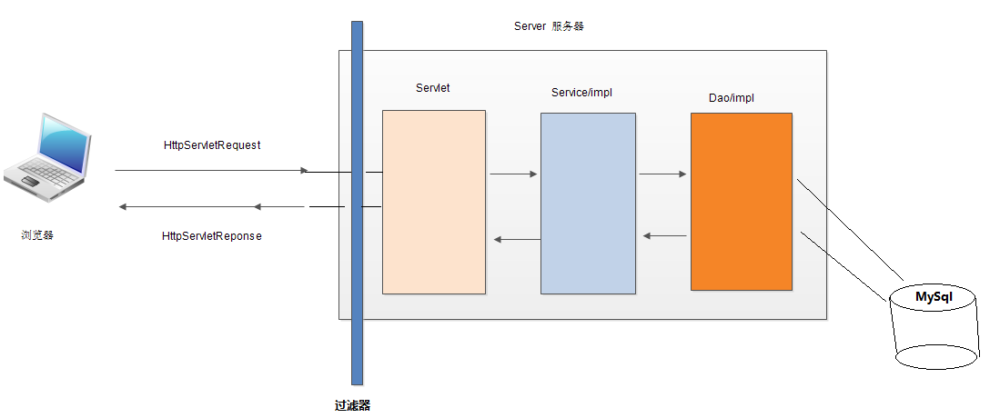
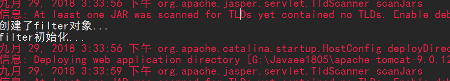
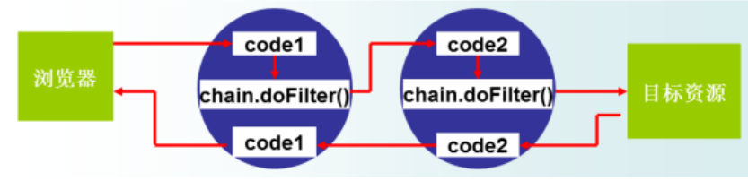

# 过滤器
* 过滤器:Filter 通过Filter对web资源进行管理，例如jsp，servlet，静态图片，html文件等进行拦截。从而实现一些特殊的功能
  * URL级别的权限访问控制
  * 过滤敏感词汇
  * 压缩响应信息
* 原理图
  * 

## 创建一个过滤器
* 使用Filter，需要实现一个Filter接口,并且需要配置xml文件
  * “/*”表示拦截所有的请求

```xml
<filter>
	<filter-name>filterDemo</filter-name>
	<filter-class>com.hr.filter.filterDemo</filter-class>
</filter>
<filter-mapping>
	<filter-name>filterDemo</filter-name>
  <!--“/*”表示拦截所有的请求 -->
	<url-pattern>/*</url-pattern>
</filter-mapping>
```

```java
public class filterDemo implements Filter {
    public filterDemo() {
        System.out.println("创建了filter对象...");
    }
	public void init(FilterConfig fConfig) throws ServletException {
		System.out.println("filter初始化...");
	}

	public void doFilter(ServletRequest request, ServletResponse response, FilterChain chain) throws IOException, ServletException {
		System.out.println("执行filter主要方法");
		chain.doFilter(request, response);
	}

	public void destroy() {
		System.out.println("filter对象销毁了...");
	}

}
```

## Filter生命周期
* 发布对象时创建对象并且初始化
  * 
* 访问web资源时调用filter
  * **这里验证码又调用了一次filter**
  * 
* 服务器关闭时执行销毁的方法

## Filter的执行
 >doFilter(),在该方法内编写代码可达到如下目的：
 调用目标资源之前，让一段代码执行。
 是否调用目标资源（即是否让用户访问web资源）。
 调用目标资源之后，让一段代码执行。

**通过filterChain.doFilter()方法实现放行**

## FilterConfig
  * `String getFilterName()`：得到filter的名称。
  * `String getInitParameter(String name)`： 返回在**xml中指定名称**的初始化参数的值

```xml
  <filter>
  	<filter-name>filterDemo</filter-name>
  	<filter-class>com.hr.filter.filterDemo</filter-class>
  	<!--配置FilterDemo过滤器的初始化参数 -->
  	<init-param>
  		<param-name>encode</param-name>
  		<param-value>UTF-8</param-value>
  	</init-param>
  </filter>
```
```java
public class filterDemo implements Filter {

	private String encode="";

	public void init(FilterConfig fConfig) throws ServletException {
		System.out.println("getFilterName():"+fConfig.getFilterName());
		encode = fConfig.getInitParameter("encode");
		System.out.println("encode:"+encode);
	}

	public void doFilter(ServletRequest request, ServletResponse response, FilterChain chain) throws IOException, ServletException {
		//根据配置文件设置编码格式
		request.setCharacterEncoding(encode);
		HttpServletRequest req = (HttpServletRequest) request;

		System.out.println("执行filter主要方法");
		chain.doFilter(req, response);
	}
}
```

## <url-pattern>配置

* /具体路径 eg。/index.jsp 表示只有index。jsp才会进入过滤器
* /* 表示所有资源都会进入过滤器
* /*.do 表示以.do结尾的资源会进入过滤器

## 注解配置过滤器

`@WebFilter(value="/*",initParams= {@WebInitParam(name = "encode", value = "UTF-8"),@WebInitParam(name = "name", value = "java")})`
```java
  @WebFilter(value="/*",initParams= {@WebInitParam(name="p",value="haha")})
  public class filterDemo3 implements Filter{
  	String name="";
  	String p = "";
  	@Override
  	public void init(FilterConfig filterConfig) throws ServletException {
  		p = filterConfig.getInitParameter("p");
  		name = filterConfig.getFilterName();
  	}
  	@Override
  	public void doFilter(ServletRequest request, ServletResponse response, FilterChain chain)
  			throws IOException, ServletException {
  		System.out.println("demo3执行了");
  		System.out.println(p+"\t"+name);
  		chain.doFilter(request, response);
  	}
  }
```

## 过滤器链
* 服务器调用Servlet之前会执行一组过滤器（多个过滤器）,那么这组过滤器就称为一条过滤器链
* 一组过滤器中的执行顺序与<filter-mapping>的配置顺序有关


## 过滤器的应用

### 禁止浏览器缓存动态页面

```java
	public void doFilter(ServletRequest request, ServletResponse response, FilterChain chain)
			throws IOException, ServletException {
		//转换对象
		HttpServletRequest req = (HttpServletRequest) request;
		HttpServletResponse resp = (HttpServletResponse) response;
		//禁止浏览器缓存所有动态页面
		resp.setDateHeader("Expires", -1);
		resp.setHeader("Cache-Control","no-cache");
		resp.setHeader("Pragma", "no-cache");
		//放行
		chain.doFilter(req, resp);
	}
```
### 登陆的权限验证(防止越界访问)

```java
//登陆权限验证,拦截除了登陆界面jsp以及生成验证码servlet
@WebFilter(value="/*")
public class filterDemo3 implements Filter{
	@Override
	public void doFilter(ServletRequest request, ServletResponse response, FilterChain chain)
			throws IOException, ServletException {
		//转换为httpservlet对象
		HttpServletRequest req = (HttpServletRequest) request;
		HttpServletResponse resp = (HttpServletResponse) response;

		//获取url地址，判断是否为不需要拦截的地址
		String requestURI = req.getRequestURI();
		System.out.println(requestURI);
		//获取url想要执行的方法
		String action = req.getParameter("action");
		System.out.println(action);
		//获取session中的对象
		User loginUser = (User)req.getSession().getAttribute("loginUser");
		//loginUser有对象则表示用户已经登陆，不用拦截
		if (loginUser!=null) {
			chain.doFilter(req, resp);
			return;
		}
		//可以不需要登陆的url，不用拦截
		if ("login".equals(action) || requestURI.contains("login.jsp") || requestURI.contains("CodeServlet")) {
			chain.doFilter(req, resp);
			return;
		}
		//没有放行的重定向
		resp.sendRedirect("login.jsp");
	}
}

```

### 自动登陆
