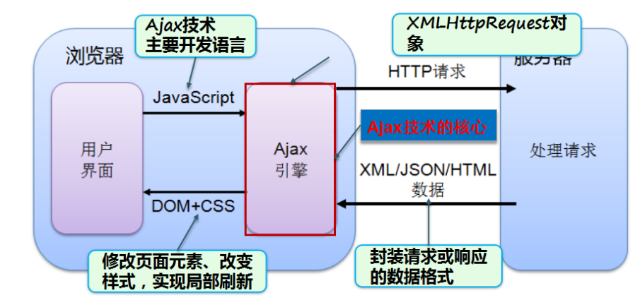
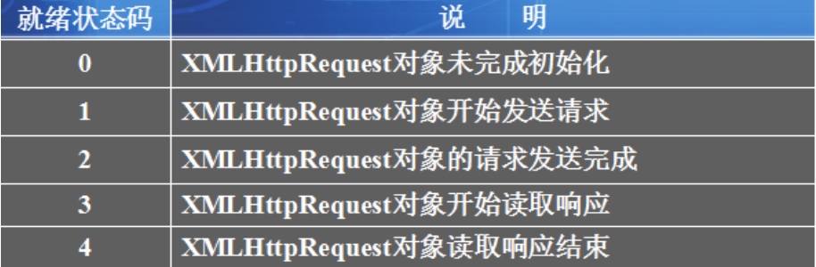
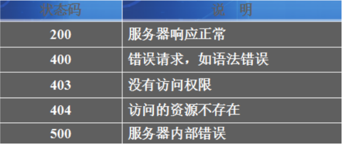
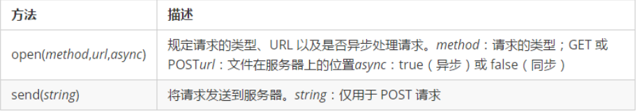

# AJAX
* AJAX 异步javascript and xml(以及他的子集)
* 可以在不刷新整个网页的情况下**刷新局部页面**
* 应用场合
  * 异步的提交数据到后台
  * 校验是否可用状态
  * 异步加载下拉框
  * 自动补全
  * 异步删除
  * ........
* AJAX工作原理
  * 

## AJAX基础使用
* **创建XMLHttpRequest**
  * `new XMLHttpRequest();`
* **设置回调函数**

  ```java
  xhr.onreadystatechange = function(){
    if(xhr.readyState == 4 && xhr.status == 200){
    	var data = xhr.responseText;
      alert(data);
    }
  };

  ```
* **readyState属性**
  * **readyState** 属性存有服务器响应的状态信息。每当 readyState 改变时，onreadystatechange 函数就会被执行。
    * 
  * **Status**
    * 
* **向服务器端发送请求，并传递必要的参数**
  * 

* **获得服务器端相应回来的数据**
  * 如需获得来自服务器的响应，请使用 XMLHttpRequest 对象的 responseText 或 responseXML 属性。
* 使用post传递参数
  ```java
    xhr.open("post","请求路径",true);
    xhr.setRequestHeader("Content-Type","application/x-www-form-urlencoded");
    xhr.send("参数名1="+参数1+"&参数名2"+参数2);
  ```

## AJAX JSON运用案例
```javascript
  window.onload=function(){
  	getStaffs();
  	getDepts();
  }
  //Ajax,json运用
  function getStaffs(){
  	//获得select节点
  	var staffs = document.getElementById("staffs");
  	//创建对象
  	var xhr = new XMLHttpRequest();
  	//设置回掉函数
  	xhr.onreadystatechange=function(){
  		if(xhr.readyState == 4 && xhr.status == 200){
  			var data = xhr.responseText;
  			//alert(data);
  			//JsonString转换为json对象
  			var html="";
  			var jsonArray=JSON.parse(data.trim());
  			html+="<option value='-1'>--请选择--</option>";
  			for(var i=0;i<jsonArray.length;i++){
  				html+="<option value="+jsonArray[i].staffId+">"+jsonArray[i].staffName+"</option>";
  			}
  			staffs.innerHTML=html;
  		}
  	};
  	//初始化请求
  	xhr.open("GET","${pageContext.request.contextPath}/empServlet.do?action=getStaffs",true);//异步加载
  	//发送请求
  	xhr.send();
  }
```
```html
	<select name="staffName" id="staffs">
		<option value="-1">--请选择--</option>
	</select>
```
```java
//获取行动参数
String action = request.getParameter("action");
if ("getStaffs".equals(action)) {//获取所有职位列表
	List<Staff> staff = ss.getStaff();
	String jsonString = JSON.toJSONString(staff);
	System.out.println(jsonString);
	response.getWriter().write(jsonString);
}
```
